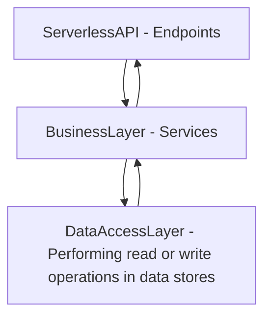
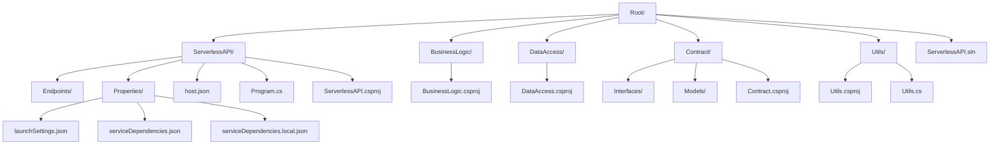

# Introduction

This document serves as a comprehensive guide for the project at hand. It aims to articulate the objectives and the driving motivation behind the development of this API, providing a clear overview for stakeholders and contributors alike.

## Objectives

The primary objective of this project is to develop a RESTful API that provides a simple and intuitive structure for running on an azure function.

## Dependencies

The following dependencies are required to run the API:

- [net8.0](https://dotnet.microsoft.com/en-us/download/dotnet/8.0)

## 🚀 Installation

For local installation and execution of the API, proceed with the following steps:

1. Clone this [repository](https://eysbp.visualstudio.com/TAS%20-%20Capital%20Edge/_git/ce4-chatbot-dotnet-api) to your local environment
2. Make sure you have dependencies installed

## Run the API

To initiate the API locally, execute the following command:

1. Visual Studio
    1. Go to File -> Menu -> Open Project/Solution and select the *.sln file
    2. Make sure the Azure Function project to be set as Startup Project
    3. Press F5 to run the project

## Contribute

### 🔖 API Versioning

We employ semantic versioning to manage API versions, ensuring compatibility with existing clients and facilitating tracking of changes. Semantic versioning includes three segments: major, minor, and patch versions (e.g., 1.0.0).

Modify the version number according to the nature of your changes:

1. **Patch version** (`1.0.X`): Increment the last digit for minor adjustments, bug fixes, and performance enhancements that do not impact the API's functionality.
2. **Minor version** (`1.X.0`): Increment the middle digit for backward-compatible features and modifications.
3. **Major version** (`X.0.0`): Increment the first digit for changes that break backward compatibility, necessitating client-side adjustments.

It is crucial to adjust the version number post modifications to communicate new features and compatibility of the API effectively.

## Three layer architecture

## Overall Solution Structure

### `root` (Root Directory)

The root directory serves as the initial point for the project, encompassing global configuration files, the file solution, and folders for the projects.

#### `ServerlessAPI Project` (Entry point)

It acts as the entry point with HTTP triggers, validate the provided data and pass it thought the BusinessLogic layer

##### `Properties Folder`

The "Properties" folder in an Azure Function .NET project contains various project-specific configuration files and settings that are used during development, building, and deployment of the Azure Functions project.

###### `launchSettings.json`

This file contains settings used by Visual Studio and the .NET Core CLI to configure how the application is launched for debugging or execution. It includes profiles for different environments (e.g., Development, Production) and settings such as the application URL, environment variables, and launch options

##### `Endpoints Folder`

The purpose of that folder it is to keep all endpoint group by class in a manner that reflex business units

##### `host.json`

It is a configuration file used in Azure Functions to define global settings and behavior for the Azure Functions host. It follows JSON format.

##### `ServerlessAPI.csproj`

It is a project file used in .NET projects, including Azure Functions projects, to define project-specific settings, references, dependencies, and build configurations. It is an XML-based file that contains metadata and instructions for building and compiling the project

##### `Program.cs`

The file serves as the entry point for the Azure Functions runtime and configure services

#### `BusinessLogic Project` (Business rules)

Represents the business logic layer. It manages all business rules and processing logic and if need to get some data call DataAccess layer

##### `BusinessLogic.csproj`

It is a project file used in .NET projects, including Azure Functions projects, to define project-specific settings, references, dependencies, and build configurations. It is an XML-based file that contains metadata and instructions for building and compiling the project

#### `DataAccess Project` (Data access)

Represents the data access layer. It handles accessing data and performing read or write operations in the database or other data stores

##### `DataAccess.csproj`

It is a project file used in .NET projects, including Azure Functions projects, to define project-specific settings, references, dependencies, and build configurations. It is an XML-based file that contains metadata and instructions for building and compiling the project

#### `Utils Project (General functionalities)`

While not representing a specific layer, it provides general functionalities used across various layers of the system.

##### `Utils.csproj`

It is a project file used in .NET projects, including Azure Functions projects, to define project-specific settings, references, dependencies, and build configurations. It is an XML-based file that contains metadata and instructions for building and compiling the project

#### `Contract Project (Models and interfaces)`

While not representing a specific layer, it contains models and interfaces used to decouple projects and define contracts between the layers of the system

##### `Interfaces Folder`

It helps decouple dependencies between projects by providing a centralized location for defining contracts for interaction. These interfaces abstract implementation details, promote loose coupling, and make code more modular and maintainable. By adhering to the Dependency Inversion Principle and encapsulating behavior, the "Interfaces" folder facilitates flexibility, easier testing, and extensibility in the solution.

##### `Models Folder`

Models folder is used to store the classes that represent the data and business logic in addition promotes code reuse, encapsulation, and cleaner project structure, while reducing dependencies and facilitating easier testing and maintenance.

##### `Contract.csproj`

It is a project file used in .NET projects, including Azure Functions projects, to define project-specific settings, references, dependencies, and build configurations. It is an XML-based file that contains metadata and instructions for building and compiling the project
