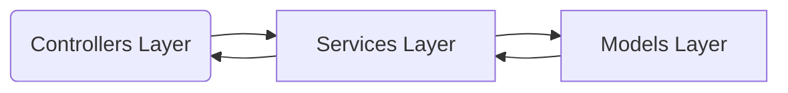

# Table of contents

- [Overview](#overview)
- [Components list and description](#components-list-and-description)
- [Design and Patterns](#design-and-patterns)
  - [Design](#design)
  - [Patterns](#patterns)

# Overview

This document serves as a guide to understand the structure established in the Project and the components involved and their relationships, along with the design and patterns used to support it.

The solution was written using .net core 8.0 framework and consists of three projects, the main project EY.CapitalEdge.HelpCopilot, a utilities project EY.CapitalEdge.HelpCopilot.Utils, and a unit testing project EY.CapitalEdge.HelpCopilot.Tests. The internal structure of each is described in more detail below.

# Components list and description

EY.CapitalEdge.HelpCopilot: The primary objective of this project was to develop a wrapper for invoking the SAT Knowledge Assistant API, selectively abstracting the essential endpoints needed for system integration. Additionally, it aimed to implement customizable retry and time limit policies, thereby simplifying the complexity of the main system (Orchestrator) that utilizes this wrapper.

Controllers: The folder contains the class design for managing HTTP requests associated with the SAT Knowledge Assistant API through the service.

Models (Folder): Contains all the classes with the contracts that we use to call and receive knowledge assistant API responses. 

Services: Contains all the classes and their contracts used for sending requests to and receiving responses from the Knowledge Assistant API using HttpClient.

Static: Contains the constants used in the project, such as the names of variables read from the key vault, the URLs of the endpoints to be called, and other constants used to centralize their maintenance.

appsettings.json: Holds application-level configurations, such as the log levels used within the system.

Dockerfile: Specifies the configuration for the Docker container, including the base image, dependencies, and commands to construct an application image.

Program.cs: It is responsible for configuring and launching the ASP.NET Core web application, setting up essential services like configuration management, logging, HTTP client policies, and defining the middleware pipeline for handling requests.

EY.CapitalEdge.HelpCopilot.Utils: The aim of this project was to establish a centralized repository for code that requires reuse across various parts of the main project.

EY.CapitalEdge.HelpCopilot.Tests: The primary objective of this project was to ensure comprehensive unit test coverage for the main project, thereby enhancing its overall quality and reliability.

# Design and Patterns

## Design

As the project is a wrapper to call the SAT Knowledge Assistant, the goal was to keep the structure as simple as possible by defining three main layers, with additional layers to support them, such as a Utils project that contains common methods used across all classes.

Controllers Layer: This layer interacts with users. It receives requests, validates data, routes them to the services, and returns the response. It is implemented via the Controllers folder.

Services Layer: Is responsible for handling communication with external services. It makes requests to these services as needed, processes the responses, and provides the necessary data to other parts of the application. This layer ensures that external interactions are managed efficiently and consistently.

Models Layer: The Models layer contains the classes used for mapping data obtained from external services. It also defines the data structures expected by the controllers and the data returned to users. This centralization ensures consistency and clarity in data handling throughout the application.

Static: The Static layer contains all the constants used throughout the project at a general level. This includes fixed values such as configuration settings, error messages, and default values. By centralizing these constants, the Static layer ensures consistency and makes the codebase easier to maintain and update.

## Patterns

Singleton: It has been used to expose common utility class ensures a single instance is used across the application, promoting consistency and efficiency by avoiding the creation of multiple instances. It provides global access to the utilities, allowing easy access from anywhere within the application. Additionally, it offers control over the instantiation process, ensuring thread safety and resource management. This approach simplifies the architecture and reduces resource consumption.

Dependency Injection: Utilized to decouple components and their dependencies, making the system more modular, easier to test, and flexible for changes. It allows for the dynamic provision of dependencies, enhancing scalability and maintainability.

Factory Pattern: Utilized with HttpClientFactory, this strategy simplifies the creation of HttpClient instances, automatically handling the disposal of resources.

Strategy Pattern: Using the Polly library, timeout and retry policies are applied, which internally leverage the strategy design pattern.
