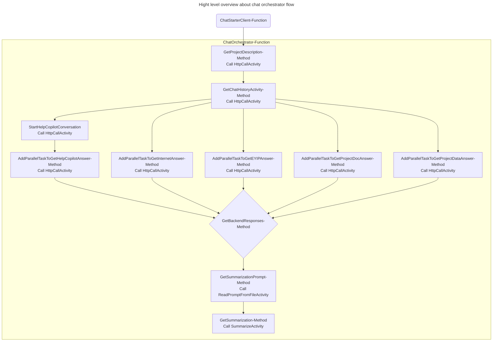

# Table of contents

- [Overview](#overview)
- [Components list and description](#components-list-and-description)
- [Design and patterns](#design-and-patterns)
  - [Design](#design)
    - [Clients](#clients)
    - [Orchestrators](#orchestrators)
    - [Activities](#activities)
    - [General Design](#general-design)
  - [Patterns](#patterns)
- [Components diagram](#components-diagram)

# Overview

This document serves as a guide to understand the structure established in the Chat Orchestrator project and the components involved and their relationships, along with the design and patterns used to support it.

The goal of the AI-based system named CoPilot is to aid users with various tasks associated with their EY projects through a chat interface. It integrates data from multiple sources, including the internet, SAT Knowledge Assistant, EY IP Asset Manager, and project-specific applications such as PMO, Operating Model, Value Capture, and TSA, as well as project documents stored in SharePoint.

The project is built upon Azure Durable Functions to meet the requirement of orchestrating various data sources exposed through different APIs in parallel using fan-out/fan-in pattern, function chaining pattern for dependent call and asynchronous HTTP polling pattern to get question responses and status. This approach aims to provide a solution that scales dynamically and enables rapid development.

The solution consists of three projects the main project EY.CapitalEdge.ChatOrchestrator, a utilities project EY.CapitalEdge.ChatOrchestrator.Utils, and a unit testing project EY.CapitalEdge.ChatOrchestrator.Tests. The internal structure of each is described in more detail below.

# Components list and description

EY.CapitalEdge.HelpCopilot: The primary objective of this project was to develop a wrapper for invoking the SAT Knowledge Assistant API, selectively abstracting the essential endpoints needed for system integration. Additionally, it aimed to implement customizable retry and time limit policies, thereby simplifying the complexity of the main system (Orchestrator) that utilizes this wrapper.

Controllers: The folder contains the class design for managing HTTP requests associated with the SAT Knowledge Assistant API through the service.

Models (Folder): Contains all the classes with the contracts that we use to call and receive knowledge assistant API responses. 

Services: Contains all the classes and their contracts used for sending requests to and receiving responses from the Knowledge Assistant API using HttpClient.

Static: Contains the constants used in the project, such as the names of variables read from the key vault, the URLs of the endpoints to be called, and other constants used to centralize their maintenance.

appsettings.json: Holds application-level configurations, such as the log levels used within the system.

Dockerfile: Specifies the configuration for the Docker container, including the base image, dependencies, and commands to construct an application image.

Program.cs: It is responsible for configuring and launching the ASP.NET Core web application, setting up essential services like configuration management, logging, HTTP client policies, and defining the middleware pipeline for handling requests.

# Design and patterns

## Design

Azure Durable Functions employ an orchestrator and activity-based design to facilitate the creation of complex, long-running workflows in serverless applications. This design revolves around three primary components: Clients, Orchestrators and Activities.

### Clients

It is responsible for initiating the main flow based on different types of events, in this case, an HTTP trigger is used. It also serves as a validator for the data input made by the user into the system.

### Orchestrators

Orchestrators are functions that dictate the logic and sequence of operations within a workflow. They use a domain-specific language (DSL) to outline the execution of activities, handle outcomes, and direct the flow of execution, including branching, looping, and waiting. Orchestrators are deterministic by design, meaning they should produce the same outcome given the same inputs. This determinism is crucial for enabling the replayability and restartability of workflows from checkpoints.

### Activities

Activities represent the individual units of work executed by the orchestrators. They embody specific tasks such as making an HTTP call, accessing a database, or performing a complex calculation. Activities are stateless functions that can be invoked by an orchestrator and can execute asynchronously.

### General Design

The overall design of Azure Durable Functions allows for:
- Long-Running Executions: Through state persistence and checkpoints, workflows can last from seconds to months, surpassing the execution time limit of regular Azure Functions.
- Advanced Programming Patterns: Supports patterns like function chaining, fan-out/fan-in, monitors, and human interaction patterns, making it easier to implement complex logic.
- Scalability and Reliability: Built on Azure Functions, they inherit the platform's scalability and reliability, enabling the processing of large and variable workloads.
- State Management: Workflow state is automatically managed, allowing orchestrators to resume from the last checkpoint after a failure or restart, ensuring consistency and error recovery.

This design enables developers to focus on the specific business logic of their applications while the framework handles implementation details such as state management, scalability, and the durability of workflows.

## Patterns

Singleton: It has been used to expose common utility class ensures a single instance is used across the application, promoting consistency and efficiency by avoiding the creation of multiple instances. It provides global access to the utilities, allowing easy access from anywhere within the application. Additionally, it offers control over the instantiation process, ensuring thread safety and resource management. This approach simplifies the architecture and reduces resource consumption.

Dependency Injection: Utilized to decouple components and their dependencies, making the system more modular, easier to test, and flexible for changes. It allows for the dynamic provision of dependencies, enhancing scalability and maintainability.

Factory Pattern: Utilized with HttpClientFactory, this strategy simplifies the creation of HttpClient instances, automatically handling the disposal of resources.

Fan out/fan in: It has been used to call the sources in parallel and then performing a summarization for the results, doing so helps to have the minimum time on response depending on the slowest source.

Function chaining: Is employed to orchestrate a sequence of dependent service calls, such as those required by a Sat Knowledge Assistant. This approach involves invoking three distinct endpoints in a specific order, where the output from one call serves as the input for the next. This sequential process is crucial for aggregating the necessary data to formulate a response for a chat interaction. Using that azure durable function pattern ensures that the system stay durable and scalable.

# Components diagram

