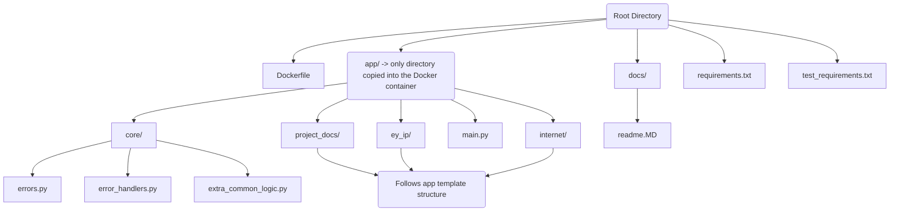
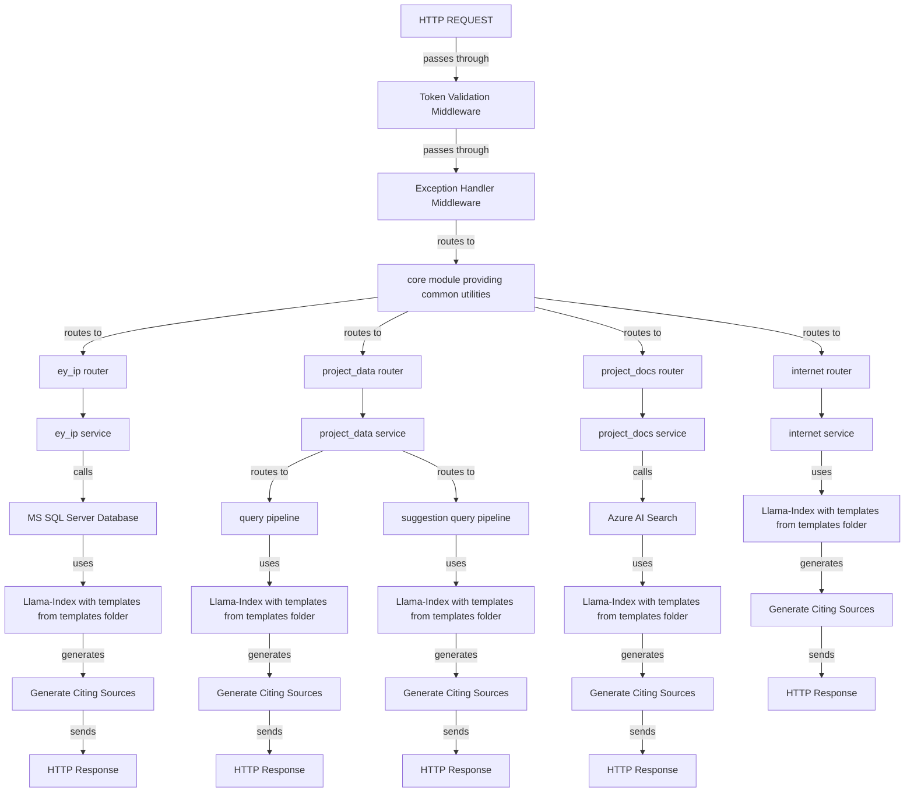
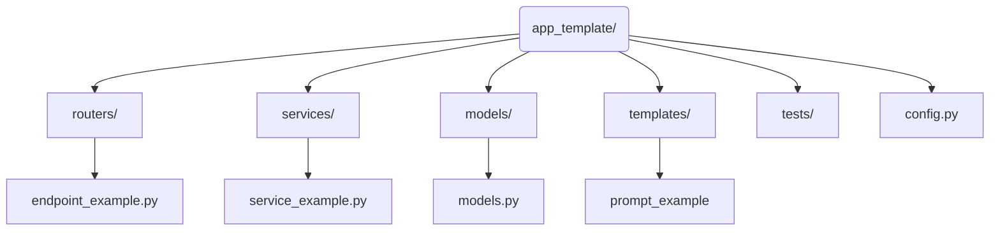
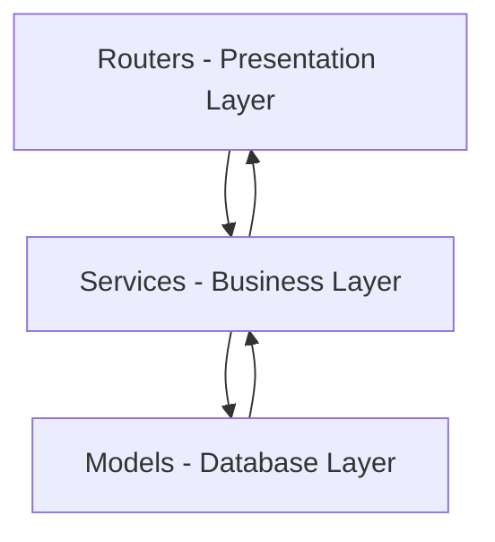

# Introduction
This document serves as a comprehensive guide for the project. It outlines the objectives and the motivation behind the development of this API, providing a clear overview for stakeholders and contributors alike.

# Getting Started

## Dependencies
- Python version 3.11.7 is required.
- Python dependencies are managed through `requirements.txt` and `test_requirements.txt`.
- Docker is required for containerization and deployment.

## Defining Environment Variables
Before running the API, it's crucial to set the following environment variables:

### Logging
- `APP_INSIGHTS_INSTRUMENTATION_KEY`: Azure Insights instrumentation key
- `LOGGING_LEVEL`: Logging level for the application (e.g., "DEBUG", "INFO", "ERROR")

### Authentication and Security
- `KEY_VAULT_URL`: URL to the Azure Key Vault for secure secret storage
- `JWT_PUBLIC_KEY`: (Optional) JWT public key for token validation if not stored in Key Vault

### EY IP Backend
- `EY_IP_PROJECT_CONTEXT_INDEX`: AI Search context index name.
- `EYIP_MEMORY_SIZE`: Negative number representing how much previous messages are used as chat history.

### Project Data Backend
- `PROJECT_DATA_MEMORY_SIZE`: Negative number representing how much previous messages are used as chat history.
- `PROGRAM_OFFICE_TIMEOUT`: Time in seconds until raising a timeout for program office requests.

### Project Docs Backend
- `PROJECT_DOCS`: Negative number representing how much previous messages are used as chat history.
- `PROJECT_DOCS_RETURN_CHUNKS`: Enable chunk ID and chunk text in project docs citing sources.

### INTERNET Backend
- `INTERNET_MEMORY_SIZE`: Negative number representing how much previous messages are used as chat history.

### AI Search
- `AI_SEARCH_API_KEY`: AI Search API Key  
- `AI_SEARCH_ENDPOINT`: AI Search endpoint
- `AI_SEARCH_API_VERSION`: AI Search API version

### Prompt Management
- `PROMPT_API_URL`: URL for the prompt management API
- `PROMPT_MANAGER_STRATEGY`: Strategy for prompt retrieval ("api", "yaml", or "hybrid")

### Security Best Practices
- Never hardcode sensitive values directly in your code
- Use Azure Key Vault for storing API keys and secrets
- JWT tokens are automatically validated by the middleware
- All API endpoints require proper authorization headers
- Follow the principle of least privilege when configuring access

### Confidence Scores
- `ENABLE_CONFIDENCE_SCORES`: Set to true to enable confidence score calculation

## Pre-commit
To ensure code quality and adherence to formatting standards, a pre-commit dependency is indispensable. It performs checks and validations locally before code is pushed to a remote repository. Follow these steps to install:

1. Install the pre-commit module via `python -m pip install pre-commit`.
2. Activate the pre-commit hook within your local repository by executing `pre-commit install`.
3. To manually run pre-commit checks, use `pre-commit run`.

Upon installation, the pre-commit hook will automatically run specified checks prior to each commit. If any checks fail, address the issues identified in the staging area.

## 🚀 Installation

For local installation and execution of the API, proceed with the following steps:

1. Clone the repository to your local environment.
2. Install the necessary dependencies by running `python -m pip install -r requirements.txt`.
3. Install the nltk requirements by running `python -m nltk.downloader popular`.

## Run the API
To initiate the API locally, execute the following command:

- Start the server with `python -m uvicorn app.main:app --reload --loop asyncio`.
- Access the API via [http://localhost:8000/](http://localhost:8000).
- For API Swagger documentation, visit [http://localhost:8000/docs](http://localhost:8000/docs).

To initiate the API using Docker, follow these steps:

- Run `docker-compose up --build` to start the API container.

## Test API

Install the test requirements with `python -m pip install -r test_requirements.txt`.

With Docker: Execute the tests with coverage using:

- `docker build -f Dockerfile.test -t capital-python-test .`

Local: Execute the tests with coverage using:

- `pytest --cov=.`

This generates a folder inside the output directory called `tests_coverage_report` where the results are stored.

## Debugging
A `launch.json` file is located inside the `.vscode` folder. This file contains all the configurations needed to use as a template in any IDE with DAP (Debug Adapter Protocol) support. If using VS Code, you only need to press F5 to start debugging.

## Overview

The project is methodically organized to segregate core functionalities, documentation, and application components into designated folders. The root level contains configuration files and Docker support, facilitating modular development, deployment simplicity, and documentation clarity.

### `root` (Root Directory)
The root directory serves as the initial point for the project, encompassing global configuration files, Docker support mechanisms, and folders for applications and documentation.

#### `app`
Essential for the operation of the application, this directory is the sole component copied into the Docker container. It contains:

- **`core`**: Houses shared core functions such as error handling and common logic.
- **`project_docs`, `ey_ip`, `internet`, `project_data`**: Various application modules, each adhering to a specific organizational structure.

#### `docs`
Comprises the project's documentation, including the `readme.MD` which provides a project overview, setup instructions, and additional vital information.

#### `.coveragerc` 
Specifies the configuration for coverage.py which is used to the code coverage percentage calculation.

#### `conftest.py`
Configuration and setup file for pytest fixtures and test configurations.

#### `Dockerfile`
Specifies the configuration for the Docker container, including the base image, dependencies, and commands to construct an application image.

#### `Dockerfile.test`
Specifies the configuration for the Docker container to run tests, including the base image, dependencies, and commands to construct an application image.

#### `requirements.txt` and `test_requirements.txt`
Enumerate the Python package dependencies required for running and testing the project, respectively.

#### `tenacity.yaml`
Configuration file for tenacity, a Python library for retrying operations.

### Components List and Descriptions

Each module (e.g., `project_docs/`, `ey_ip/`, etc.) is organized according to a specific structure, encompassing models, services, schemas, and files for configurations, database sessions, endpoints, and services.

### `main.py`
Main file that acts as the primary entry point for the application, initiating the FastAPI application.

### `core`
Located within `app`, this directory encapsulates crucial functions and logic applicable across the application, promoting code reuse and modularity.

- `ai_search.py`: Centralizes AI Search integration.
- `azure_llm_models.py`: Contains the Azure LLM models.
- `config.py`: Centralizes application configurations and settings.
- `error_handlers.py`: Implements custom exception handlers.
- `errors.py`: Defines custom exception types.
- `interfaces.py`: Module which defining interfaces for various components.
- `key_vault.py`: Module for interacting with Azure Key Vault to manage secrets, keys, and certificates.
- `logger.py`: Configures the application logger.
- `memory.py`: Contains Utility class to build memory from a payload.
- `middleware.py`: Implements middleware functions.
- `ms_server_manager.py`: Module for managing and interacting with Microsoft SQL servers.
- `nltk.py`: Module for natural language processing using the NLTK library.
- `pydantic_models.py`: Contains Pydantic models.
- `singleton_meta.py`: Implements a singleton metaclass.
- `utils.py`: Contains utility functions.

### Backends structure

### `ey_ip` 
Package which contains the EY IP backend logic.

#### `routers`
Hosts files that define backend endpoints. FastAPI routers connect endpoint paths to their corresponding handler functions.

- **`assistant_agent.py`**: main backend endpoint.

#### `services`
Dedicated to the application's business logic, separating operational processes from endpoint handling and data management.

- **`ai_search.py`**: Child AI Search integration class.
- **`assistant_agent.py`**: main service for backend.

#### `templates`
Contains YAMLs files with prompt templates.

#### `tests`
Includes tests for the application module to ensure functionality and expected performance, encompassing unit tests, integration tests, and other testing methodologies to validate the application's integrity and reliability.

#### `tools`
Package that holds modules used by the `assistant_agent.py` service to build the llama-index agent used in the backend.

#### `config.py`
`config.py` outlines specific application settings and configurations.

### `internet` 
Package which contains the Internet backend logic.

#### `routers`
Hosts files that define backend endpoints.

- **`internet.py`**: main backend endpoint.

#### `services`
Dedicated to the application's business logic, separating operational processes from endpoint handling and data management.

- **`internet.py`**: main service for backend.

#### `templates`
Contains YAMLs files with prompt templates.

#### `tests`
Includes tests for the application module to ensure functionality and expected performance, encompassing unit tests, integration tests, and other testing methodologies to validate the application's integrity and reliability.

### `project_data` 
Package which contains the project_data backend logic.

#### `functions`
Hosts files that define functions used by query pipelines in the backend.

#### `routers`
Hosts files that define backend endpoints.

- **`project_data.py`**: main backend endpoint.

#### `services`
Dedicated to the application's business logic, separating operational processes from endpoint handling and data management.

- **`ai_search.py`**: Child AI Search integration class.
- **`program_office.py`**: Program Office API wrapper.
- **`project_data.py`**: Main service that uses consume query pipelines.
- **`query_pipeline.py`**: Main project data query pipeline.
- **`suggestion_query_pipeline.py`**: Suggestion project data query pipeline.

#### `templates`
Contains YAMLs files with prompt templates.

#### `tests`
Includes tests for the application module to ensure functionality and expected performance, encompassing unit tests, integration tests, and other testing methodologies to validate the application's integrity and reliability.

#### `config.py`
`config.py` outlines specific application settings and configurations.

### `project_docs` 
Package which contains the project_docs backend logic.

#### `routers`
Hosts files that define backend endpoints.

- **`project_docs.py`**: main backend endpoint.

#### `services`
Dedicated to the application's business logic, separating operational processes from endpoint handling and data management.

- **`ai_search.py`**: Child AI Search integration class.
- **`project_docs.py`**: Main backend service.

#### `templates`
Contains YAMLs files with prompt templates.

#### `tests`
Includes tests for the application module to ensure functionality and expected performance, encompassing unit tests, integration tests, and other testing methodologies to validate the application's integrity and reliability.

# Design and Patterns

## Three-Layer Architecture in Application Modules

Each application within the `app` directory is designed to adhere to a three-layer architecture, ensuring a clear separation of concerns and promoting modular and scalable application development. This architecture is divided into the following layers:

- **Presentation Layer**: This layer interacts with the application's users. It routes requests to the appropriate service and returns responses. It is implemented via the `routers` directory.

- **Business Layer**: The core logic of the application resides here. This layer handles business rules and requests from the presentation layer, performing the necessary operations before passing data to the database layer or back to the presentation layer. It is encapsulated within the `services` directory.

- **Database Layer**: Responsible for data persistence and retrieval. This layer interacts with the database and is represented by the `models` directory, where the database models are defined.

This structure not only aids in maintaining a clean separation between different aspects of application functionality but also enhances maintainability and scalability.

Below is a Mermaid.js diagram to visually represent the three-layer architecture:

In this architecture, the **Presentation Layer** acts as the entry point for user requests, which are then processed by the **Business Layer** according to the defined business logic. The **Business Layer** interacts with the **Database Layer** for any data persistence or retrieval operations. This separation ensures that changes in one layer (e.g., database schema changes) have minimal impact on other layers, thus promoting a more robust and adaptable application structure.

## Design patterns
A singleton design pattern was implemented in the ey_ip and project_data to avoid long initialization processes in each request. Additionally, a wrapper was implemented to handle Program Office's API requests. 

# Contribute

## 🔖 API Versioning

We employ semantic versioning to manage API versions, ensuring compatibility with existing clients and facilitating tracking of changes. Semantic versioning includes three segments: major, minor, and patch versions (e.g., 1.0.0). To update the API version, follow these steps:

1. Navigate to the `app/__init__.py` file.
2. Modify the version number according to the nature of your changes:
   - **Patch version** (`1.0.X`): Increment the last digit for minor adjustments, bug fixes, and performance enhancements that do not impact the API's functionality.
   - **Minor version** (`1.X.0`): Increment the middle digit for backward-compatible features and modifications.
   - **Major version** (`X.0.0`): Increment the first digit for changes that break backward compatibility, necessitating client-side adjustments.

It is crucial to adjust the version number post modifications to communicate new features and compatibility of the API effectively.
